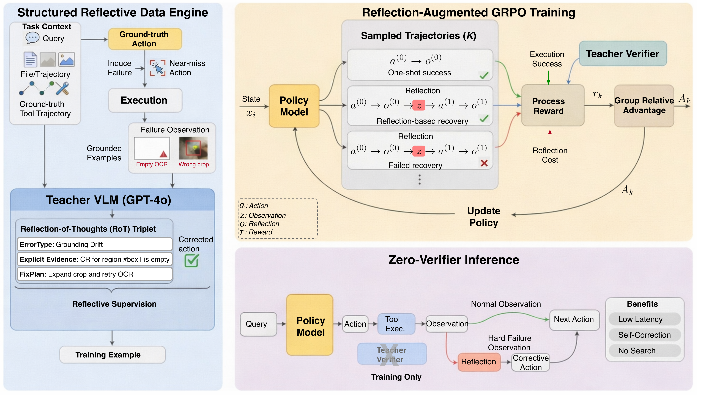

<!--
ReGRPO: Reflection-Augmented Group Relative Policy Optimization
Copyright (c) 2026 Binjie Zhang @ Show Lab
Licensed under the MIT License.
This code references MAT-Agent (https://mat-agent.github.io/).
-->

# ReGRPO: Reflection-Augmented Policy Optimization for Tool-Using Agents

**Binjie Zhang, Mike Zheng Shou** &nbsp;·&nbsp; Show Lab, National University of Singapore

Official training code for our ECCV 2026 paper **ReGRPO: Reflection-Augmented
Group Relative Policy Optimization for Tool-Using Agents**. ReGRPO teaches a
vision–language agent to **diagnose and recover from its own tool-use failures**,
instead of only imitating successful traces.

<p align="center">
  <a href="https://showlab.github.io/ReGRPO/">🌐 Project Page</a> &nbsp;•&nbsp;
  <a href="#">📄 arXiv (coming soon)</a> &nbsp;•&nbsp;
  <a href="https://github.com/showlab/ReGRPO">💻 Code</a> &nbsp;•&nbsp;
  <a href="#data">🗂️ Data (coming soon)</a>
</p>

<p align="center">
  
</p>

Tool-augmented VLMs solve multimodal, multi-step tasks by calling external tools
(web search, OCR, table/PDF readers, visual operators, code execution), but they
remain fragile: supervised fine-tuning learns mostly from successful trajectories
and gives little signal for recovery, while sparse trajectory-level RL rewards do
not say *which* step failed or *how* to fix it. ReGRPO closes this gap with a
two-stage training pipeline plus a verifier-free inference stage:

1. **Structured Reflective Data Engine → SFT warm-start.** Starting from a
   ground-truth tool call, we synthesize a realistic *near-miss* action
   (wrong crop / mismatched tool / corrupted argument) and obtain a grounded
   failure observation (executed in the paper; teacher-synthesized under strict
   grounding gates in this release — see *Scope &amp; faithfulness*), then pair the
   failure with a structured
   `(ErrorType, Evidence, FixPlan)` reflection and the corrected action — i.e.
   explicit **Error → Reflection → Correction** supervision (RoT data).
2. **ReGRPO reinforcement learning.** Reflection tokens become part of the
   optimized trajectory, so group-relative advantages train *both* the
   diagnostic reflection and the corrective action. The reward is

   ```
   R(τ) = λ_exec · 1{success} − η · C(τ) + λ_val · V(x, τ)
   ```

   where `C(τ)` is a reflection-cost penalty (proportional to reflection length;
   `0` for one-shot successes) and `V` is an **optional, training-only** teacher
   verifier. The first two terms already form a complete verifier-free objective.
   Group advantage `A_i^(k) = R(τ_i^(k)) − R̄_i`.
3. **Zero-verifier inference.** A deterministic trigger
   `g_i = 1{ToolError ∨ EmptyObs ∨ (i>1 ∧ u_i < κ_i)}` opens **at most one**
   local reflection-correction block per step, where `u_i = exp(mean log π_θ(action tokens))`
   and `κ_i = mean(previous u_j)`. No external verifier is ever called at deployment.

**Backbone.** The controller is **Qwen2-VL-7B** with LoRA on the attention
projections (vision encoder and token compressor frozen). The fine-tuned model is
the **planner** inside a [MAT-Agent](https://mat-agent.github.io/)-style ReAct
loop, delegating perception and search to tool models.

---

## Key Results

Same Qwen2-VL-7B backbone and tool suite for all methods, single-path
zero-verifier inference; AnsAcc = answer accuracy (paper, Table 1).

| Method (controller) | GTA AnsAcc | GAIA AnsAcc |
| --- | :---: | :---: |
| MAT-Agent / T3-Agent (MAT-Qwen2-VL-7B) | 53.85 | 16.97 |
| SPORT (Tuned-Qwen2-VL-7B) | 60.26 | 20.61 |
| **ReGRPO (default, λ_val = 0)** | **67.66** | **23.35** |

The verifier-free default (`λ_val = 0`) is already the strongest among the
compared open-source controllers; the optional deterministic verifier reward
adds a further `+0.83 / +0.66` (GTA/GAIA).

---

## Repository Structure

```
ReGRPO/
├── regrpo/
│   ├── common/        # io.py, trajectory.py (AST tool-call parser), schema.py (RoT records + validators)
│   ├── data/          # RoT data engine: teacher_client, perturb, prompts, quality, build_rot, verify_rot
│   ├── sft/           # Stage-1 RoT-SFT — text: train_sft.py; vision: convert_qwen_vl.py, finetune_qwen_vl.py
│   ├── rl/            # Stage-2 ReGRPO — core.py, environment.py, trainer_minimal.py (text), trainer_qwen_vl.py (vision)
│   ├── inference/     # zero-verifier trigger.py + ReGRPOAgent (offline replay smoke)
│   ├── configs/       # data_rot.yaml, sft_*.yaml, regrpo_*.yaml
│   └── scripts/       # run_build_rot.sh, run_sft.sh, run_regrpo.sh, run_inference.sh
├── samples/           # tiny validated fixtures so the smokes run with no data/API key
├── docs/              # project page (enable: Settings → Pages → Deploy from a branch → main, /docs)
├── requirements.txt
├── LICENSE
└── README.md
```

`regrpo/rl/core.py` is a framework-independent, unit-checkable implementation of
the paper's reward, group advantage, reflection-aware sequence log-prob, and KL —
shared by both the text and vision trainers.

### Scope &amp; faithfulness

This release is a **faithful, runnable reference** for the ReGRPO algorithm,
made reproducible without a live multi-tool sandbox:

- **RL** is instantiated on a deterministic **offline contrastive environment**
  (`rl/environment.py::OfflineReplayEnvironment`): each group contains the correct
  action, the near-miss failure, the reflection-and-correct recovery, a bare retry,
  and a corrupted action, so group-relative advantages have non-zero variance. The
  reward, advantage, reflection-aware log-prob, KL, and trigger all match the paper
  exactly; `ToolEnvironment` is the documented hook for future on-policy online
  rollouts against real tools.
- **RoT failure observations** are synthesized by the teacher VLM under strict
  schema + evidence-grounding gates (an *offline synthetic reference*), rather than
  produced by live tool execution at generation time.

These choices are explicit so results are not over-claimed; the vision path
reproduces the paper's agent on Qwen2-VL-7B with real tools via the external
MAT-Agent harness.

---

## Two reproduction paths

ReGRPO ships **two training paths that share the same RL core and offline
environment**. Pick by your goal:

| Path | Model | Trainers | Environment | Purpose |
| --- | --- | --- | --- | --- |
| **A. Text reference** | any Qwen2.5 causal LM | `sft/train_sft.py` + `rl/trainer_minimal.py` | this repo's deps (recent `transformers`) | Faithful, CPU-smokeable reference for the algorithm |
| **B. Vision repro** | `Qwen2-VL-7B-Instruct` | `sft/finetune_qwen_vl.py` + `rl/trainer_qwen_vl.py` | legacy MAT-Agent stack (GPU) | Reproduce the paper's multimodal agent |

The text path runs end-to-end on CPU as a unit-tested reference; the vision path
reproduces the paper on GPU.

---

## 1. Installation

### Path A — text reference (this repo)

```bash
conda create -n regrpo python=3.10 -y && conda activate regrpo
pip install -r requirements.txt
export PYTHONPATH="$PWD:$PYTHONPATH"   # make `regrpo` importable from the repo root
```

### Path B — vision reproduction (GPU)

The vision path uses the legacy MAT-Agent stack because Qwen2-VL agent tooling
depends on `transformers.agents` (removed in `transformers ≥ 5`). Keep it in a
**separate** environment.

```bash
conda create -n regrpo_vl python=3.10 -y && conda activate regrpo_vl
# transformers==4.50.2, peft, accelerate, deepspeed, qwen_vl_utils, ...
pip install "transformers==4.50.2" peft accelerate deepspeed qwen_vl_utils torch
export PYTHONPATH="$PWD:$PYTHONPATH"
```

> Evaluation on GTA / GAIA uses the external
> [MAT-Agent](https://mat-agent.github.io/) ReAct harness, which is **not bundled
> here** — this release focuses on training (data preparation → environment →
> training). The trained LoRA adapter is a standard PEFT adapter you can drop into
> that harness as the planner.

---

## 2. Data preparation

<a name="data"></a>

ReGRPO trains on two corpora:

| File | Description | Status |
| --- | --- | --- |
| `dataset/mat_train.json` | Clean MAT-Agent / MM-Traj ReAct trajectories (the source data) | from [MM-Traj](https://mat-agent.github.io/) |
| `dataset/rot_train.json` | **RoT reflection corpus** (Error → Reflection → Correction triplets) — the core data deliverable | **pending (to be released)** |
| `samples/{mat_train,rot_train}.sample.json` | Tiny validated fixtures shipped with the repo | included |

> **RoT data: coming soon.** The released `rot_train.json` will be uploaded
> separately. Until then, the bundled `samples/` fixtures let the SFT / RL /
> inference smokes run with no download and no API key, and you can regenerate RoT
> data from any clean MM-Traj-style corpus with the data engine below.

### 2.1 Generate RoT data with the engine

The Structured Reflective Data Engine perturbs ground-truth steps, asks a teacher
VLM (GPT-4o by default) for a grounded failure + structured reflection, runs strict
quality gates (schema + evidence-grounding + label-leak checks), and writes a
resumable JSONL checkpoint.

```bash
export OPENAI_API_KEY=sk-...          # any OpenAI-compatible endpoint
# (optional) export OPENAI_BASE_URL=https://your-proxy/v1
# (optional) export REGRPO_TEACHER_MODEL=gpt-4o

# Small sample (CPU, fast):
bash regrpo/scripts/run_build_rot.sh 50 dataset/rot_train.sample.json

# Full corpus (edit num_trajectories in the config; null/"all" = every trajectory):
python -m regrpo.data.build_rot --config regrpo/configs/data_rot.yaml \
  --output dataset/rot_train.json

# Audit the generated corpus (9 hard checks; non-zero exit on failure):
python -m regrpo.data.verify_rot --path dataset/rot_train.json
```

The teacher model is configured by `teacher.model` in
`regrpo/configs/data_rot.yaml`; credentials are read from the environment and are
never hard-coded. Synthesized failure observations are grounded by strict gates;
the corpus is labelled an *offline synthetic reference* (no live tool execution at
generation time).

### 2.2 Convert to Qwen-VL format (vision path only)

```bash
python -m regrpo.sft.convert_qwen_vl \
  --rot   dataset/rot_train.json \
  --clean dataset/mat_train.json \
  --clean-ratio 0.5 \
  --out   dataset/qwen_vl_train.json
```

This emits MAT Qwen-VL conversation format and tags each record's `mask_policy`
(`clean` trains all assistant turns; `rot` trains only the final
`Reflection: z + a*` turn) plus `train_turn_index`.

---

## 3. Quickstart (CPU smoke, text path)

Steps 2–4 run end-to-end on the bundled `samples/` fixtures — **no dataset and no
API key needed**. The base model (Qwen2.5-0.5B) downloads on first run; set
`HF_HUB_OFFLINE=1 TRANSFORMERS_OFFLINE=1` once cached.

```bash
# 1) (optional) RoT data engine — needs OPENAI_API_KEY; demos on samples/mat_train.sample.json
bash regrpo/scripts/run_build_rot.sh 6

# 2) Stage-1 RoT-SFT warm start (Qwen2.5-0.5B + LoRA, >=1 step)  -> .cache/sft_smoke
bash regrpo/scripts/run_sft.sh 1

# 3) Stage-2 ReGRPO RL on the offline-contrastive environment (>=1 step)  -> .cache/regrpo_rl_smoke
bash regrpo/scripts/run_regrpo.sh 1

# 4) Zero-verifier inference — one trajectory; the trigger fires on the injected failure
bash regrpo/scripts/run_inference.sh
```

Expected: step 4 prints `reflections_fired=1` — a single local reflection-correction
block opens on the injected `tool_error`. To chain RL on top of the Stage-1 adapter,
set `init_adapter: .cache/sft_smoke` in the RL config (text or vision).

---

## 4. Training

### 4.1 Text reference path

```bash
# Stage-1 SFT  -> LoRA adapter at ./checkpoints/regrpo_text_sft
python -m regrpo.sft.train_sft   --config regrpo/configs/sft_full.yaml

# Stage-2 RL   -> LoRA adapter at ./checkpoints/regrpo_text_rl
python -m regrpo.rl.trainer_minimal --config regrpo/configs/regrpo_full.yaml
```

Override the backbone with any HF id, e.g.
`model_name: Qwen/Qwen2.5-7B-Instruct` in the config. To warm-start RL from the
Stage-1 SFT adapter (the paper's two-stage recipe), set
`init_adapter: ./checkpoints/regrpo_text_sft` in `regrpo_full.yaml`.

### 4.2 Vision reproduction path (Qwen2-VL-7B, GPU)

```bash
conda activate regrpo_vl

# Stage-1: RoT-aware Qwen2-VL LoRA SFT (clean trains all turns; RoT trains only the reflection turn)
python -m regrpo.sft.finetune_qwen_vl \
  --data dataset/qwen_vl_train.json \
  --model Qwen/Qwen2-VL-7B-Instruct \
  --output-dir ./checkpoints/regrpo_vision_sft \
  --max-len 8192 --bf16 --use-lora --gradient-checkpointing --use-images

# Stage-2: Qwen2-VL ReGRPO RL (stability recipe), starting from the SFT adapter
python -m regrpo.rl.trainer_qwen_vl \
  --config regrpo/configs/regrpo_vl_stab.yaml \
  --data dataset/rot_train.json
```

Set `model_name` / `init_adapter` in `regrpo/configs/regrpo_vl_stab.yaml` to your
local Qwen2-VL-7B and Stage-1 adapter paths.

### 4.3 Key RL hyper-parameters

Defaults (`regrpo/configs/regrpo_*.yaml`): `group_size=5`, `lambda_exec=1.0`,
`eta=0.1`, `lambda_val=0.0`, `beta` (KL) `0.04`–`0.3`. The vision stability recipe
adds `length_normalize`, `advantage_normalize`, `advantage_clip=1.0`,
`grad_clip_norm=1.0`, and a short LR warmup.

> **Verifier note.** This repo defaults to the **verifier-free** setting
> (`lambda_val=0`), which the paper reports as the strongest open-source result.
> The paper's reported default *also* explores an optional teacher verifier with
> `lambda_val=0.3` and grounding-weighted subscores `(w_a, w_g, w_p)=(0.25,0.50,0.25)`.
> Set `lambda_val>0` to enable the optional, training-only verifier reward; it is
> **never** called at inference.

---

## 5. Environment variables

| Variable | Default | Effect |
| --- | --- | --- |
| `OPENAI_API_KEY` | — | Teacher VLM key for RoT data generation (training/inference do not need it). |
| `OPENAI_BASE_URL` | OpenAI default | Optional base URL for a self-hosted / proxy endpoint. |
| `REGRPO_TEACHER_MODEL` | `gpt-4o` | Teacher model for the RoT data engine. |
| `REGRPO_SHUFFLE_RECORDS` | `1` | Shuffle records before the RL step budget (vision trainer). |
| `HF_HUB_OFFLINE`, `TRANSFORMERS_OFFLINE` | unset | Set to `1` for fully offline runs once models are cached. |

---

## 6. Citation

```bibtex
@inproceedings{zhang2026regrpo,
  title     = {ReGRPO: Reflection-Augmented Group Relative Policy Optimization for Tool-Using Agents},
  author    = {Zhang, Binjie and Shou, Mike Zheng},
  booktitle = {European Conference on Computer Vision (ECCV)},
  year      = {2026}
}
```

---

## License & Attribution

Released under the [MIT License](LICENSE) — Copyright (c) 2026 Binjie Zhang @ Show
Lab. This code references and builds on
[MAT-Agent](https://mat-agent.github.io/).
